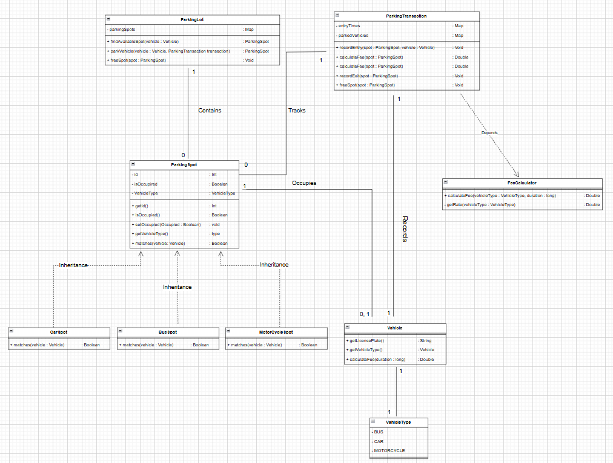

# AirTribe Assignment - Smart Parking Lot

## Overview

This Smart Parking Lot System is a Java-based application designed to manage vehicle parking, parking spot allocation, transactions, and fee calculation.
It efficiently handles different types of vehicles (Car, Motorcycle, Bus) and supports concurrent vehicle entry and exit operations.

The system focuses on clean architecture, scalability, and thread-safe operations, making it suitable for real-world parking lot management.

## Features

- **Parking Spot Management:**  Allocates parking spots dynamically based on vehicle type compatibility.

- **Vehicle Entry & Exit:** Tracks vehicle parking and calculates parking fees based on duration and type.

- **Fee Calculation:** Different strategies for calculating fees based on the type of vehicle.

- **Concurrency Handling:** Supports multiple vehicles entering and exiting simultaneously using thread-safe operations.
- **Extensible Design:** Easily add new vehicle types, new spot types, or change fee calculation strategies.


## Technologies Used

- **Java 20**
- **Object-Oriented Programming (OOP)**
- **SOLID Principles**
- **Design Patterns (Factory, Strategy)**
- **Java Collections Framework (Map, Concurrent Collections)**
- **Concurrency (Synchronized Blocks)**


## Prerequisties

- Java 15+
- IDE(STS, Eclipse, IntelliJ or VsCode)

## Note on Data Persistence 

The application uses in-memory storage (ConcurrentHashMap) to simulate database behavior for managing parking spots and transactions.
In real-world applications, this would be replaced with a proper persistent storage solution like MySQL or MongoDB.

## Project Structure

```bash

src
├── main
│   ├── ParkingLot                       # Manages parking spots and vehicle operations
│   ├── Bus                              # Manages Bus Information
│   ├── Car                              # Manages Car Information
│   ├── MotorCycle                       # Manages MotorCycle Information
│   ├── ParkingTransaction               # Handles vehicle entry, exit, and fee calculations
│   ├── Vehicle                          # Represents vehicle data and behavior
│   ├── VehicleType                      # Represents vehicleType data
│   ├── FeeCalculator                    # Strategy for calculating parking fees
│   ├── ParkingLotTesting                # Main runner class for parking lot operations
│   ├── ParkingSpots                     # Contains various ParkingSpot types (CarSpot, MotorCycleSpot, BusSpot)
│       ├──BusSpot                       # Contains BusSpot Details
│       ├──CarSpot                       # Contains CarSpot Details
│       ├──MotorCycleSpot                # Contains MotorCycleSpot Details
├── README.md
├── UML_Image
│   ├── UML

```
### Concurrency Handling
  - The system uses fine-grained locking (ReentrantLock) and synchronized blocks to ensure thread safety when:-
      - Allocating parking spots
      - Recording entry and exit of vehicles
      - Freeing spots after vehicle departure

    - **Example:**  
        - parkVehicle(), freeSpot(), and recordEntry() methods are synchronized to prevent race conditions.

        
## UML Diagram

 
## Design Patterns Implemented in the Smart Parking Lot

### 1. Factory Pattern  
   - Used for creating different types of ParkingSpot instances (CarSpot, MotorCycleSpot, BusSpot).
   - Centralized the object creation logic when initializing the parking lot.
   - **Example:**  

     - During parking lot setup, spots are created dynamically based on their type.

          parkingSpots.put(i, new CarSpot(i));
          parkingSpots.put(i + totalSpots / 3, new MotorCycleSpot(i + totalSpots / 3));
          parkingSpots.put(i + 2 * totalSpots / 3, new BusSpot(i + 2 * totalSpots / 3)); 

### 2. Strategy Pattern  
   - Used for Fee Calculation based on different vehicle types.
  - Easily extendable to add different pricing rules for new types of vehicles. 
   - **Example:**  

     - The FeeCalculator class calculates the parking fee dynamically based on vehicle type and duration.

        double fee = FeeCalculator.calculateFee(vehicle.getVehicleType(), duration);

 
